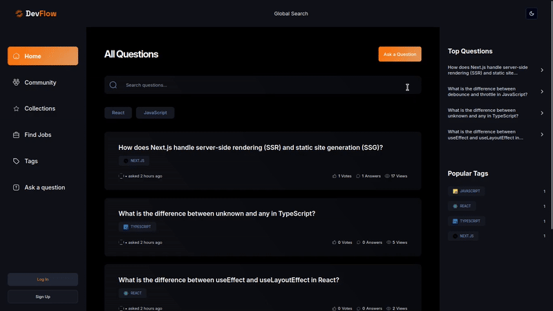

# Devflow - AI-Powered Q&A Platform

## A full-stack, community-driven platform inspired by Stack Overflow, built with Next.js 15, MongoDB, and OpenAI.

This project was built along with the [Ultimate Next.js Course](https://www.jsmastery.pro/ultimate-next-course), covering modern Next.js features like SSG, ISR, SSR, PPR, Server Functions, Caching, and Revalidation. The application enables developers to ask questions, post answers, vote, explore recommendations, and engage with gamification elements like badges and rewards.



This web application allows users to:

- Authenticate using NextAuth with multiple providers (Email/Password, Google, GitHub);
- Ask and answer questions, with AI-powered responses using OpenAI;
- Upvote/downvote questions and answers to highlight valuable content;
- Bookmark questions for later reference;
- Discover jobs with advanced filtering;
- Browse users, tags, and recommended topics;
- Personalize the interface with light/dark mode.

<!-- RUN APP -->

## Run Application

### Prerequisites

Ensure you have the following installed:

- [Node.js](https://nodejs.org/) (version 18+ recommended)
- [npm](https://www.npmjs.com/) (comes with Node.js)

### Setup

1. **Clone the repository**

   ```sh
   git clone https://github.com/your-username/devflow.git
   cd devflow
   ```

2. **Install dependencies**

   ```sh
   npm install
   ```

3. **Set up .env**

   ```
   AUTH_SECRET="your_auth_secret"
   AUTH_GITHUB_ID="your_github_id"
   AUTH_GITHUB_SECRET="your_github_secret"
   AUTH_GOOGLE_ID="your_google_id"
   AUTH_GOOGLE_SECRET="your_google_secret"
   MONGODB_URI="your_mongodb_uri"
   OPENAI_API_KEY="your_openai_api_key"
   AUTH_URL="http://localhost:3000"
   ```

4. **Start the development server**

   ```
   npm run dev
   ```

   The application should now be running at http://localhost:3000/.

<!-- DEMO -->

## Live Demo

Coming soon!

<!-- CONTACT -->

## Contact

Pedro Trasfereti - [LinkedIn](https://www.linkedin.com/in/pedro-trasfereti/) - pedrotrasfereti@gmail.com

<p align="right">(<a href="#top">back to top</a>)</p>
